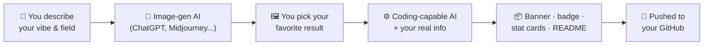

<div align="center">

# ✨ Two Prompts, One Profile

### Turn any face, any field, any skill set into a profile like this one — no design or coding experience required


<br/>


</div>

<br/>

> [!NOTE]
> This is **Pratham's** repo — if you fork or copy this, swap the name, email,
> and GitHub username throughout for your own before publishing.

This README, the banner above it, the swinging ID badge, and the stat cards
weren't hand-built — they came from handing an AI two carefully-written
prompts. The first makes a character portrait of *you*, in *your* field, in
whatever visual style you want. The second hands that portrait to a
coding-capable AI along with your real info and gets back a complete,
working profile. Both prompts below are templates — every `[BRACKET]` is
yours to fill in, whether you're an engineer, a designer, a musician, a
chef, or anything else.

---

### 🗺️ The pipeline



### 📖 Contents

- [Step 1 — Generate your character image](#-step-1--generate-your-character-image)
- [Step 2 — Generate your profile assets](#-step-2--generate-your-profile-assets)
- [Step 3 — Put it on GitHub](#-step-3--put-it-on-github)
- [What your AI needs to be able to do](#-what-your-ai-needs-to-be-able-to-do)
- [Notes from building this the first time](#-notes-from-building-this-the-first-time)

---

## 🎨 Step 1 — Generate Your Character Image

Fill in every `[BRACKET]`, then hand the whole paragraph to an
image-generation AI (ChatGPT/DALL·E, Midjourney, Gemini, etc.) exactly as
written.

<details open>
<summary><strong>▸ Prompt template — click to collapse</strong></summary>

```text
[ART STYLE — e.g. "High-quality anime-style illustration" / "Photorealistic
digital portrait" / "Stylized 3D-rendered character" / "Flat vector
illustration"] of a talented [YOUR ROLE — e.g. "AI engineer", "backend
developer", "product designer", "chef", "musician"] seated/standing in a
[WORKSPACE OR SETTING VIBE — e.g. "modern black ergonomic chair inside a
premium minimalist workspace"]. [PRONOUN — He/She/They] has [HAIR
DESCRIPTION], [EYE COLOR] eyes, [SKIN TONE] skin, [FACIAL FEATURES /
EXPRESSION], and a [MOOD OF EXPRESSION — e.g. "calm, confident smile"].

[PRONOUN] wears [OUTFIT DESCRIPTION — style, colors, any cultural or
personal inspiration], paired with [BOTTOM WEAR] and [FOOTWEAR].

[THE TOOLS OF YOUR CRAFT — e.g. "A laptop on the desk displays VS Code
with Python and Docker" / "A workbench holds sketching tablets and color
swatches" / "A kitchen counter has fresh ingredients and a knife roll"].
[OPTIONAL: floating screens / props / instruments relevant to your field].

[OBJECTS THAT REPRESENT YOU — e.g. "Books beside them include [3–7
TITLES]" / "Vinyl records stacked nearby" / "A shelf of trophies"].

Accessories include [PERSONAL ITEMS — a mug engraved with a phrase, a
notebook, small decorative objects that reflect your personality].

The scene conveys [3–5 MOOD WORDS — e.g. "luxury, intelligence,
creativity"] with [FURNITURE/PALETTE COLOR], [LIGHTING COLOR] ambient
lighting, [VISUAL EFFECTS — e.g. "soft glowing accents"], and a [OVERALL
ATMOSPHERE] atmosphere. The overall mood is [MOOD WORDS]. [QUALITY TAGS —
e.g. "Ultra-detailed illustration, premium character art, vibrant
lighting, masterpiece quality, full-body composition, 8K."]
```

</details>

> [!TIP]
> Generate 3–4 variations and pick the one that actually matches the vibe
> you wanted — the more specific your brackets, the less picking you'll
> need to do.

> [!IMPORTANT]
> Whatever the image AI actually gives you — style, background (plain,
> transparent, or a full scene) — is what you describe **truthfully** in
> Step 2. An AI that trusts the wrong description will make the wrong
> calls when it tries to process the image.

Already have a photo or artwork you'd rather use? Skip straight to Step 2
with that instead — this step is optional, not a requirement.

---

## ⚙️ Step 2 — Generate Your Profile Assets

Fill in every `[BRACKET]`, then give this to a coding-capable AI **with
the image from Step 1 attached**.

<details open>
<summary><strong>▸ Prompt template — click to collapse</strong></summary>

```text
I'm attaching my character image ([DESCRIBE THE IMAGE YOU ACTUALLY GOT —
e.g. "anime-style, transparent background" / "realistic style, full scene
background, no transparency" — be accurate, not aspirational]). Build me a
complete premium animated GitHub profile README that reflects my identity
as a [YOUR ROLE / TITLES] rather than a generic template profile.

My information:

Name: [YOUR NAME]

Role:
[YOUR ROLE / TITLES, separated by " • "]

GitHub Username:
[YOUR GITHUB USERNAME]

Email:
[YOUR EMAIL]

Education (optional):
[YOUR DEGREE / SCHOOL / EXPECTED GRADUATION, or delete this section]

Primary Fields:
[LIST 6–10 SHORT PHRASES — your specialties/interests]

Core Technologies / Tools:
[GROUP YOUR STACK OR TOOLKIT INTO YOUR OWN CATEGORIES — e.g. Languages,
Frameworks, Databases, Cloud, Design Tools, Instruments — add or remove
categories to match what you actually use. Don't force categories that
don't apply to you.]

Favorite Quote:
[A SHORT QUOTE OR PERSONAL MOTTO — yours, not someone else's copyrighted
line]

Design Theme:
Create a premium [1–2 STYLE WORDS — e.g. "futuristic", "minimalist",
"editorial", "warm and handcrafted"] aesthetic using [YOUR COLOR PALETTE,
3–6 colors]. The overall style should feel like [A REFERENCE VIBE] rather
than [WHAT TO AVOID].

The atmosphere should communicate: [3–6 THEMES RELEVANT TO YOUR FIELD]

Avoid [A STYLE YOU DON'T WANT — e.g. "overly flashy cyberpunk visuals"].
Instead, prioritize [QUALITIES YOU WANT — e.g. "elegance, subtle lighting,
depth, glassmorphism, cinematic motion"].

──────────────────────────────
Deliver these files:
──────────────────────────────

1. banner.svg — a premium animated SVG (~1280×740) matching the theme
   above. Include: animated background atmosphere (grid/particles/glow),
   a terminal- or ticker-style intro sequence typed out with a blinking
   cursor (write your own intro lines), my character revealed through a
   one-time holographic scan effect with a repeating scan beam every few
   seconds, a role title that cycles smoothly between [YOUR ROLE
   VARIATIONS — 5–8 of them], and a short animated status/detail strip.
   Keep it legible and uncluttered — prioritize a few well-executed
   moments over cramming in everything.

2. banner-light.svg — same banner, light-mode palette, switched
   automatically via a <picture> prefers-color-scheme tag.

3. lanyard.svg — a swinging ID badge: my photo cropped from the uploaded
   image, name, role, GitHub username, a barcode-style decoration, a real
   scannable QR code linking to my GitHub, drops from the top with a
   pendulum swing that settles into a slow idle sway.

4. Local, self-generated stat cards (no third-party card-generator
   dependency) — stats.svg, langs.svg, trophies.svg, and a real
   contribution-activity graph — pulling my ACTUAL GitHub data
   (repos/followers/languages/contributions), not placeholder numbers.
   Also generate a GitHub Actions workflow that re-runs the generator on a
   schedule and commits the refreshed cards, so these stay live instead of
   going stale as a one-time snapshot.

5. README.md — polished, centered, sections: Hero Banner, Introduction,
   Primary Fields, Interests, Tech Stack / Toolkit, Featured Projects,
   GitHub Statistics, Contribution Graph, Trophies, Languages, GitHub
   Snake, Connect With Me, Footer.

   Featured Projects:
   [FOR EACH PROJECT: Name — one-sentence description. 4–8 projects.]

6. A GitHub Action using Platane/snk that generates a custom-colored
   contribution snake daily and commits it to an output branch.

──────────────────────────────
Technical requirements:
──────────────────────────────
Pure SVG + CSS + SMIL only (GitHub-compatible, no JavaScript). Embed the
character image as base64 PNG. Verify my real GitHub info automatically
where you're able to. Use cache-busting on local image references.
Responsive layout, smooth easing, accessible contrast, modern typography,
production-quality structure. Tell me clearly which parts end up static
vs. genuinely live, and what I need to do in my GitHub repo settings to
make anything scheduled/automated actually run.
```

</details>

---

## 🚀 Step 3 — Put It On GitHub

- [ ] Create a **public** repo named **exactly** `your-username/your-username` — that exact match is what makes GitHub show a README on your profile page at all.
- [ ] Add the generated files to the repo root, keeping `.github/workflows/` and `.github/scripts/` nested exactly as given to you — GitHub only recognizes workflows at that exact path.
- [ ] **Settings → Actions → General → Workflow permissions → "Read and write permissions"** — required for any workflow that commits back to your repo.
- [ ] **Actions tab → run each workflow once manually** — don't wait for the schedule; this makes the branches/files exist right away.
- [ ] Visit `github.com/your-username` to confirm it rendered. Stale image? Bump `?v=1` to `?v=2` to bust GitHub's cache.

---

## 🧩 What Your AI Needs to Be Able to Do

Step 2 goes a lot smoother with an AI that has:

| Capability | Why | If it's missing |
|---|---|---|
| 🖼️ Image upload + processing (ideally code execution) | Cropping your character out of its background for the banner/lanyard | Ask it what it *can* do with the image as-is, or pre-crop it yourself first |
| 📁 File creation / code execution | Actually producing `.svg`/`.md`/`.yml` files, not just chat text | Copy code blocks into files by hand |
| 🌐 Live web or API access | Pulling your real GitHub stats instead of guessing | Give it your numbers directly, or add the refresh workflow yourself later |

None of these are hard requirements — an AI without them can still produce
a great static result, just with a bit more manual assembly on your end.

---

## 💡 Notes From Building This the First Time

> [!TIP]
> **Describe your image honestly, not aspirationally.** If you asked for
> "anime style, white background" but got something else, say what you
> actually got.

> [!WARNING]
> **"Generate stat cards" ≠ automatically dynamic.** A generated SVG is a
> snapshot the moment it's made. Want it tracking your real activity over
> time? You need the scheduled refresh workflow — Step 2's prompt above
> already asks for it.

> [!CAUTION]
> **GitHub shades contribution graphs relative to your own activity**, not
> fixed count thresholds. If your AI builds a heatmap off invented cutoffs
> instead of GitHub's own per-day data, it may not match your real
> profile.

> [!NOTE]
> **A "banner" has limited legible space.** If your spec asks for a lot of
> distinct panels (stack, projects, interests, code, etc.) all inside one
> hero image, expect your AI to push back or move some of it to the README
> body — that's usually the right call for readability, not corner-cutting.

<br/>

<div align="center">

<sub>Built with two prompts and an AI that could run code. Yours can look nothing like this one — that's the point.</sub>

</div>
